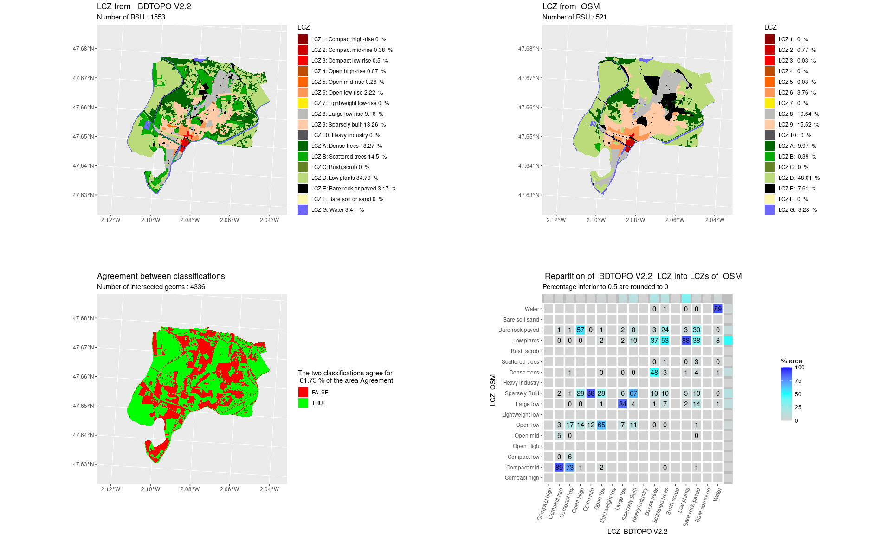
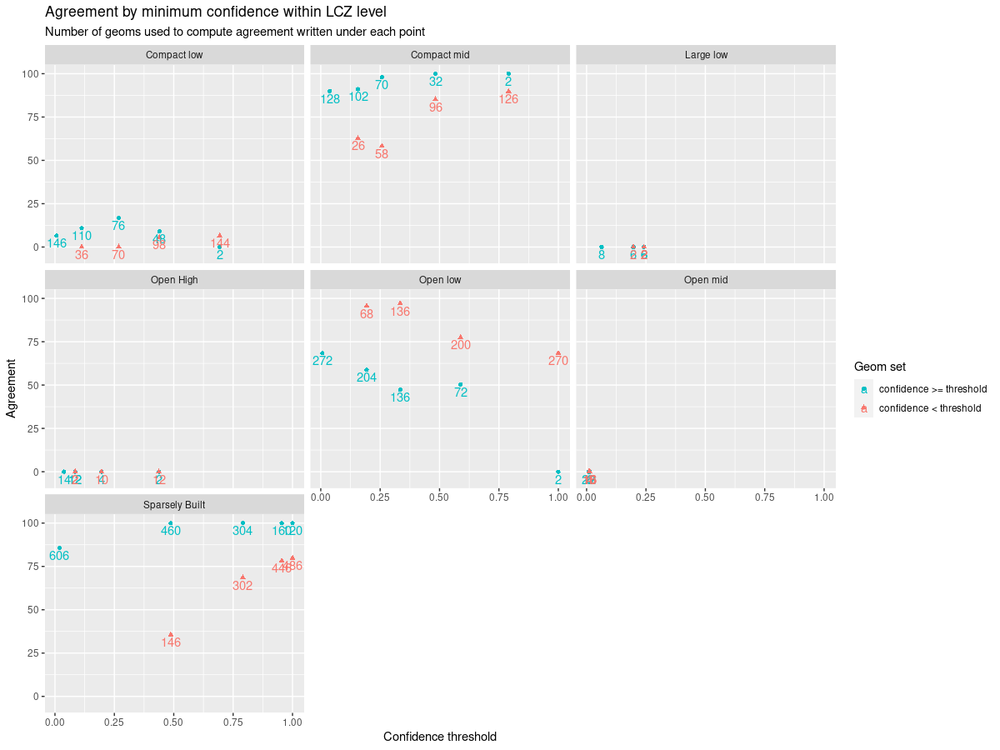

---
metadata title="lczexplore : a package to compare Local Climate Zone classifications"
output: github_document
---


# lczexplore

<!-- badges: start -->
<!-- badges: end -->

This is the 0.0.1.0000 version of the package lczexplore.

# Licence

The code of this package is under the LGPL-3 licence as described in 
https://www.r-project.org/Licenses/LGPL-3


# Fundings

The lczexplore library has been originally developed within the following research projects:
* PAENDORA2 (Pour la gestion du confort estival : Données, Outils et Recherche-Action) (2022 -2025), funded by [ADEME](https://www.ademe.fr/)

# Citation
If you are kind enough to cite this package, please check in the /inst directory for the CITATION file (in cff style without the extension)

# Installation
This package can be installed from github using the install_github function of the devtools package. 
```R
library(devtools)
devtools::install_github("orbisgis/lczexplore")
```
It can also be installed from the tarball file. 
```R
install.packages("/path/lczexplore_0.0.1.0000.tar.gz ",repos=NULL)

```
where path is the folder where you download the tarball sources. 


# Summary
The goal of  lczexplore is to explore and compare Local Climate Zone classifications of urban areas. 

Climate change is a growing concern for city planners with a special focus on Urban Heat Island phenomenons. 
Stewardt and Oke [ref] have proposed a classification of Local Climate Zones (LCZ) that describe rural and urban areas, with 10 built types and 7 land cover types. 

Several approaches classify land units into LCZ and may produce different results. 
For instance, the GeoClimate geospatial toolbox use GIS layers from OpenStreetMap or the french BD Topo 
whereas the WUDAPT platform uses remotely sensed information and local expert knowledge. 

The lczexplore packages allows to easily : 
- load these classification from GIS layers
- produce maps of these LCZ classification
- compare these classifications

# Comparison of LCZ classifications

In order to compare two LCZ classifications the compareLCZ function proceeds the following steps : 
## Plot the two classifications
Two maps are produced and allow a visual comparison of the two classifications. 

## Interesect the geometries of both classifications
This steps returns geometries on which the two classifications either totally agree either totally disagree, and plot them on a map.

## Quantify the agreement
The areas of all the geometries where the classifications agree are summed and give the general percentage of agreement.

## Qualify the disagreement
A confusion matrix shows how a given level of LCZ for the first classification is broken down 
into the levels of the other classification. 



# Sensibility analysis
Some LCZ classifications come with a confidence level for each spatial unit. For instance, the GeoClimate toolbox
sets a LCZ level to a spatial unit according to the values of urban canopy parameters, and computes a uniqueness value that indicates if other levels of LCZ could also have been set to this spatial unit. This uniqueness value can be seen as a confidence measurement of the LCZ level. 

The lczexplore package allows to see how this confidence value impacts the general agreement between two LCZ classification. 

# Main functions
The following functions are the core of this package : 
`importLCZgen` : imports the LCZ layer from a GIS (tested with geojson and shapefile files)
`importLCZwudapt` : imports LCZ from the wudapt Europe Tiff. You'll have to use `importLCZgen` first to create the Bounding box of your zone of interest
`showLCZ` : plots the map of your LCZ
`compareLCZ` : compares two LCZ classifications of the same areas, output plots and data if this comparison
`confidSensib` : explores how the agreement between two LCZ varies according to a confidence indicator associated for the LCZ value of each geom (sensibility analysis)


# Other (experimental) functions
These functions are used in the PAENDORA 2 project but may not be generic enough or robust enough for other uses. 
`LCZgroup2` : allows to group some LCZ levels into a level named by the user (for instance to group all compact LCZ, or all vegetation LCZ...)
`fetchLCZ` : allows the download and unzip of LCZ files. The user can specify the URL where the function should seek the data. 


